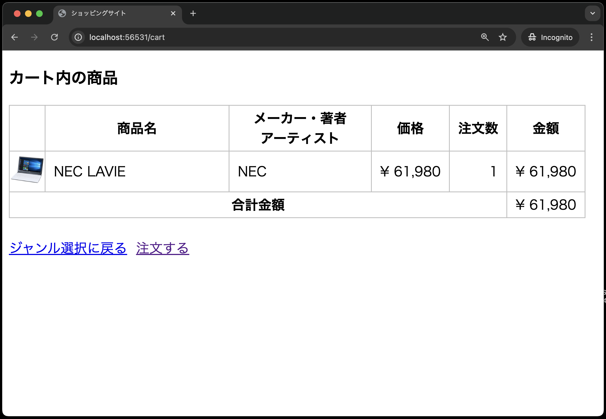
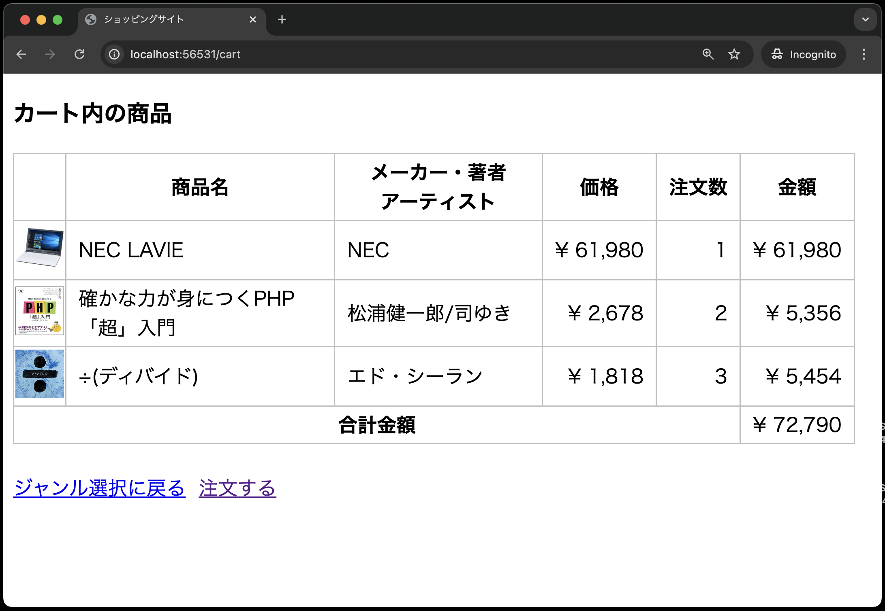
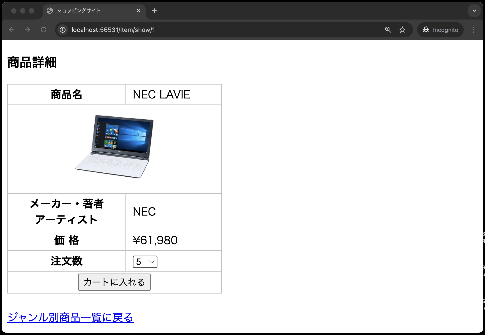
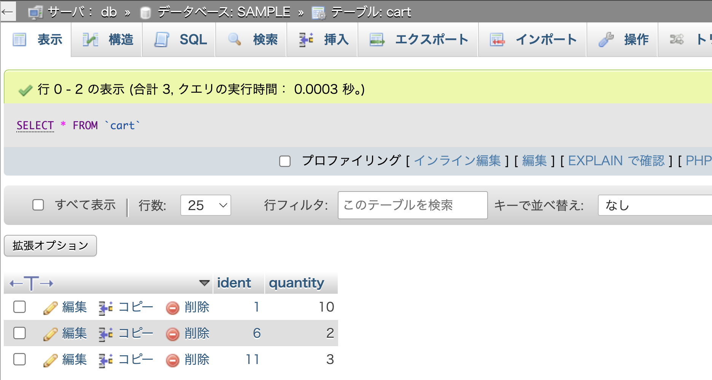

# カート内の商品画面の仕様


- カート内の商品追加
  - 同じ商品を追加すると加算される
  - 注文数が10を超える場合は、10に設定される
- カート内の商品一覧表示

の2つの機能を実装します。

## ①データベース環境構築

新しくソースコードをcloneしたので、再度データベース環境構築をする必要があります。
今回は、`items`テーブルに加え、カート内の商品を管理するための`cart`テーブルを作成します。

[CRUD機能を作ろう！(Create編)](../shop_cart_index/README.md)を参考に、データベース環境を作成してください。

## ②モデルの作成

[CRUD機能を作ろう！(Create編)](../shop_cart_index/README.md)と同様の`Cart`モデルを作成してください。

## ③ルーティングの修正

次の[④コントローラの作成](#コントローラの作成)にて、`CartController`の以下の2つのメソッドを作成します。

- `store`メソッド: カートに商品を追加する処理
- `index`メソッド: カート内の商品を一覧表示する処理

そのため、ルーティングを追加し、URLとコントローラのメソッドをマッピングする必要があります。
以下の条件を満たすように、`routes/web.php`を修正してください。

1. `cart`というURLに`POST`リクエストが送信された場合、`CartController`クラスの`store`メソッドが呼び出されるように設定し、`cart.store`という名前を付ける
2. `cart`というURLに`GET`リクエストが送信された場合、`CartController`クラスの`index`メソッドが呼び出されるように設定し、`cart.index`という名前を付ける

## ④コントローラに`store`メソッドを作成

1. コマンドを使ってコントローラ(`CartController`)を作成する
2. 作成された`app/Http/Controllers/CartController.php`に`store`メソッドを記述する

    **【`store`メソッドによるカート追加処理の流れ】**
    1. 既にカートに入っている商品かチェック
    2. 同じ商品番号がカートに登録されている場合
       - カートに登録されている注文数と追加する注文数を加算
       - 注文数が10を超える場合は、10に設定
       - 注文数を更新
    3. 同じ商品番号がカートに登録されていない場合
       - 商品番号と注文数を登録
    4. カート内の商品一覧を表示する`index`メソッドにリダイレクト

    ただし、上記を実装するには、[CRUD機能を作ろう！(Create編)](../shop_cart_index/README.md)で学んだ知識だけでは不十分なので、以下の補足を参考にしてください。

    - 「1. 既にカートに入っている商品かチェック」を実装するには...
       - この場合は主キー(商品番号)を使い、`cart`テーブルにレコードが存在するかどうかを確認する
       - 主キーでレコードを取得する方法として、[Laravelの便利な実装(ルートモデルバインディング)](../shop_item_show/README.md)の章にて「ルートモデルバインディング」を説明したが、今回は別の方法を紹介する
       - 具体的には、モデルの`find`メソッドを使って、主キー(商品番号)を指定してレコードを取得する

        ```php
        // $request->identでPOSTリクエストで渡ってきた商品番号を取得
        $cart = Cart::find($request->ident);
        ```

       - なお、前期と同様にレコードが取得できたかどうかは、`if($cart)`で判定できる
  
    - 「カートに登録されている注文数」や「追加する注文数」を取得するには...
       - `find`で取得したレコードを格納した`$cart`を使い、`$cart->quantity`でカートに登録されている注文数を取得できる
       - `Post`リクエストで渡ってきたデータである「追加する注文数」は、`$request->quantity`で取得できるが、今回は事前にバリデーションを実施しているため、`$validated['quantity']`で取得できる

    - 「注文数を更新」を実装するには...
       - `update`メソッドを使って、レコードを更新する
       - ここでは、`quantity`カラムを更新するため、`$cart->update(['quantity' => $new_quantity]);`と記述する

    - 「4. カート内の商品一覧を表示する`index`メソッドにリダイレクト」を実装するには...
       - `return redirect()->route('cart.index');`を使って、`cart.index`ルートにリダイレクトする

    これらを踏まえて、以下を穴埋めしながら`store`メソッドを作成してください。

    ```php
    <?php
    namespace App\Http\Controllers;

    use Illuminate\Http\Request;
    // Cartモデルを使う宣言を追加(穴埋め)
    use
    
    class CartController extends Controller
    {

        // 引数にRequestクラスを指定(穴埋め)
        public function store(              )
        {
            // バリデーションを実施
            $validated = $request->validate([
                // itemsテーブルのidentカラムに対して、必須入力と整数型のバリデーションを設定
                'ident' => 'required|exists:items,ident',
                // cartテーブルのquantityカラムに対して、必須入力、整数型のバリデーション、最小値1、最大値10のバリデーションを設定
                'quantity' => 'required|integer|min:1|max:10',
            ]);
            // 主キーでレコードを取得(穴埋め)
            $cart = 
            // 既にカートに商品が入っている場合(穴埋め)
            if (    ) {
                // カートに登録されている注文数と追加する注文数を加算(穴埋め)
                $new_quantity = 
                // 注文数が10を超える場合は、10に設定(穴埋め)
                if (                  ) {
                    $new_quantity = 
                }
                // 注文数を更新(穴埋め)
                $cart->
            // カートに商品が入っていない場合
            } else {
                // 商品番号と注文数を登録(穴埋め)
                Cart::
            }
            // カート内の商品一覧を表示するindexメソッドにリダイレクト(穴埋め)
            return 
        }
    ```

## ⑤コントローラに`index`メソッドを作成

作成した`CartController`に`index`メソッドを追加してください。
ただし、[CRUD機能を作ろう！(Create編)](../shop_cart_index/README.md)で学んだ知識だけでは不十分なので、以下の補足を参考にしてください。

- カート内の商品一覧を取得するには...
  - [CRUD機能を作ろう！(Create編)](../shop_cart_index/README.md)ではカートの情報だけを取得したが、今回はカートに入っている商品の詳細情報も取得する必要がある
  - 前期のPHPではSQL文に`JOIN`を使って複数のテーブルからデータを取得したが、Laravelではモデルのリレーションを使ってデータを取得する
  - モデルのリレーションは既に設定しているが、コントローラ側では、以下のように`with`メソッドを使ってリレーション先のモデルを取得する

    ```php
    // Cartモデルのデータとそれに紐づくItemモデルのデータを取得
    $carts = Cart::with('item')->get();
    ```

これを踏まえて、以下を穴埋めしながら`CartController`に`index`メソッドを追加してください。

    ```php
    public function index()
    {
        // Cartモデルのデータとそれに紐づくItemモデルのデータを取得(穴埋め)
        $carts = 
        // cart.indexビューを表示(穴埋め)
        return 
    }
    ```

## ⑥ビュー(商品詳細画面)の修正

商品詳細画面(`resources/views/item/show.blade.php`)のフォームの`action`属性を`route`関数を使って`cart.store`ルートに変更してください。

## ⑦ビュー(カート内の商品画面)の作成

最後に、カート内の商品を一覧表示するビューを作成します。

1. `resources/views`ディレクトリに`cart`ディレクトリを作成する
2. `cart`ディレクトリに`index.blade.php`を作成し、以下のように穴埋めを埋めつつ記述する

    **resources/views/cart/index.blade.php**

    
    ```php
    <!DOCTYPE html>
    <html lang="ja">
    <head>
    <meta charset="UTF-8">
    <meta name="viewport" content="width=device-width, initial-scale=1.0">
    <link rel="stylesheet" href="{{ asset('css/minishop.css')}}">
    <title>ショッピングサイト</title>
    </head>
    <body>
        <h3>カート内の商品</h3>
        <table>
        <tr>
            <th>&nbsp;</th>
            <th>商品名</th>
            <th>メーカー・著者<br>アーティスト</th>
            <th>価格</th>
            <th>注文数</th>
            <th>金額</th>
        </tr>
        @php
            // 合計金額を初期化
            $total = 0;
        @endphp

        <!--  カート内の商品を一覧表示する処理を記述(穴埋め)  -->
        @foreach(              )
            <tr>
                <td class="td_mini_img">item->image )}}"></td>
                <!-- 商品名(穴埋め) -->
                <td class="td_item_name"> {{                     }} </td>
                <!-- メーカー(穴埋め) -->
                <td class="td_item_maker"> {{                     }} </td>
                <!-- 価格(穴埋め) -->
                <td class="td_right">&yen; {{  number_format(                   ) }} </td>
                <td class="td_right"> {{ $cart->quantity }} </td>
                <!-- 金額(穴埋め) -->
                <td class="td_right">&yen; {{ number_format(                                 ) }}</td>
            </tr>
            @php
                // 合計金額を計算(穴埋め)
                $total += 
            @endphp
        @endforeach
        <tr>
            <th colspan="5">合計金額</th><td class="td_right">&yen; {{ number_format($total) }}</td>
        </tr>
        </table>
        <br>
        <!-- 注文に関するルーティングはまだ作成していないので、href属性は空にしています -->
        <a href="{{ route('index') }}">ジャンル選択に戻る</a>&nbsp;&nbsp;<a href="">注文する</a>
    </body>
    </html>
    ```

**【解説】**

`@php $total = 0; @endphp`、`@php $total += $cart->item->price * $cart->quantity; @endphp`: <br>
`@php`ディレクティブは、PHPのコードを埋め込むためのディレクティブです。
上記では変数を初期化するのに利用しています。

`$cart->item->image`: <br>
`$cart`は`Cart`モデルのオブジェクトです。
`$cart->item`は、`Cart`モデルの`item`メソッドを呼び出して、`Item`モデルのインスタンスを取得しています。
`$cart->item->image`は、`Item`モデルの`image`カラムの値を取得しています。

逆に、`$cart->quantity`の場合は、`$cart`は`Cart`モデルのインスタンスですが、`quantity`カラムは`cart`テーブルに存在するため、`$cart->quantity`で値を取得できます。

 

## ⑧動作確認

以下の3つの動作確認が確認できればOKです。

1. 商品詳細画面からカートに商品を追加できる<br>
   
   
2. 複数の商品がカートに追加できる<br>
   
3. 既にカートに入っている商品を追加すると、注文数が加算される<br>
   
   
4. 注文数が10を超える場合は、10に設定される<br>
   
   
5. phpMyAdminで`cart`テーブルを確認し、カートに追加した商品が登録されていることを確認する<br>
   